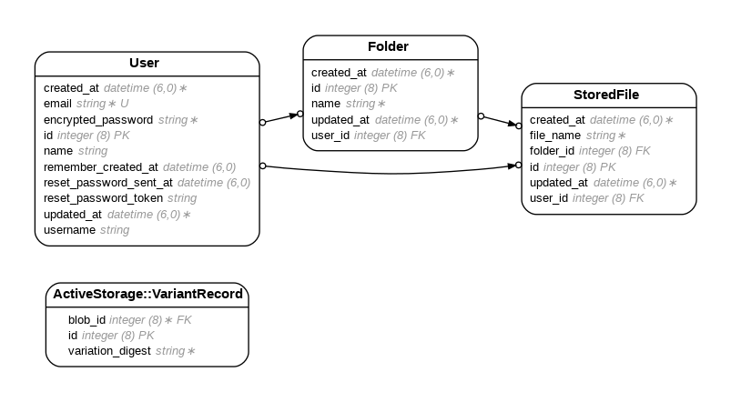

# File Vault

Secure document storage built with Ruby on Rails 8. Users authenticate, create folders, and upload files via Cloudinary. All data is scoped to the authenticated user.

---

## Tech Stack

- Ruby 3.x (see `.ruby-version`)
- Rails 8
- PostgreSQL
- Active Storage + Cloudinary
- Bootstrap 5
- Devise
- Stimulus.js
- RSpec + Capybara

---

## Local Setup

### Prerequisites
- Ruby 3.x
- PostgreSQL running locally
- Cloudinary account (free tier works)

### Installation

```bash
git clone https://github.com/Mrowe178566/document-storage-mvp
cd document-storage-mvp
bundle install
cp .env.example .env
```

Fill in `.env` with your values, then:

```bash
rails db:create db:migrate
rails server
```

App runs at `http://localhost:3000`

---

## Environment Variables

Copy the example file and fill in your own values:

```bash
cp .env.example .env
```

Required variables:

```
CLOUDINARY_CLOUD_NAME=your_cloudinary_cloud_name
CLOUDINARY_API_KEY=your_cloudinary_api_key
CLOUDINARY_API_SECRET=your_cloudinary_api_secret
DATABASE_URL=postgresql://localhost/document_storage_mvp_development
```

`.env` is in `.gitignore` and will never be committed.

---

## Database

```bash
rails db:create db:migrate    # set up
rails db:seed                 # optional sample data (coming soon)
rails db:reset                # drop, recreate, migrate
```

---

## ERD



---

## Running Tests

```bash
bundle exec rspec
```

Test coverage includes model validations, associations, and authentication flow.

---

## Project Structure

```
app/
  controllers/        # FoldersController, StoredFilesController
  models/             # User, Folder, StoredFile
  views/
    folders/          # index, show, new, edit, _form
    stored_files/     # _form
    shared/           # _nav, _flash, _breadcrumbs
    home/             # index (landing page)
  javascript/
    controllers/      # select_all_controller.js, modal_controller.js
  assets/
    stylesheets/      # components.css, custom-image.css
```

---

## Key Architectural Decisions

- **Cloudinary** via Active Storage for file hosting — no local disk storage
- **Devise** for authentication — all routes require `authenticate_user!`
- **current_user scoping** on all queries — enforced manually
- **Stimulus.js** for select-all checkbox and modal interactions
- **Turbo** enabled — forms use `turbo_confirm` for destructive actions

---

## Known Issues / In Progress

- Global file search across folders (planned: `feature/global-search`)
- Modal confirmation for delete actions (planned: `feature/modal-delete`)
- Full RSpec test suite (planned: `feature/tests`)

---

## Contribution

```bash
git checkout -b feature/your-feature
# make changes
git commit -m "feat: describe your change"
git push origin feature/your-feature
# open PR against main
```

Branch naming: `feature/`, `fix/`, `refactor/`

---

## License

MIT — Maia Rowe
