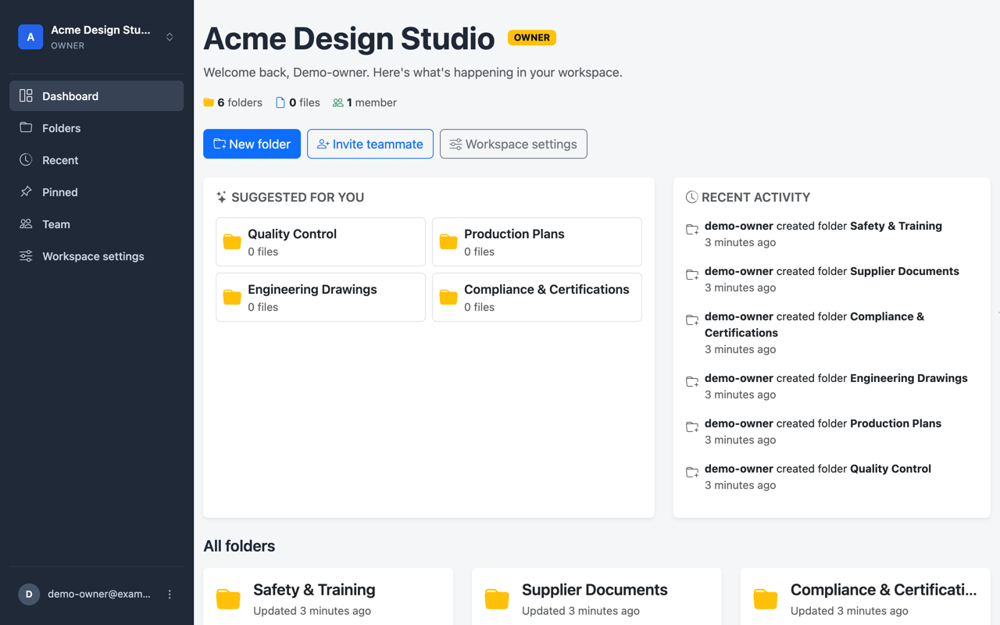
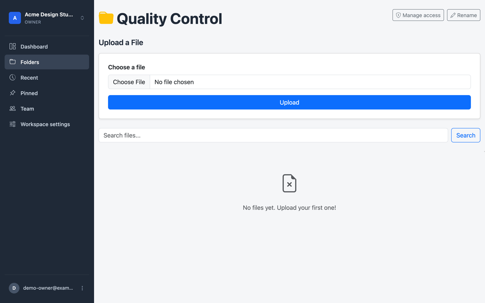
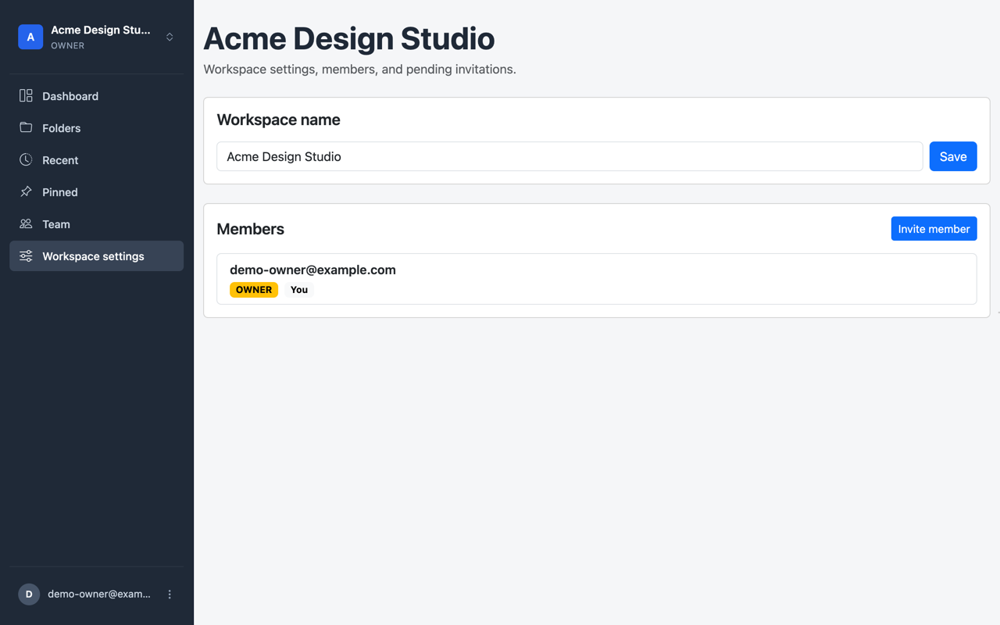

# File Vault

File Vault is a Rails 8 multi-tenant document storage app. A user signs up by naming their workspace and becomes its owner; admins of a workspace can invite teammates by email, every member shares the same folders and files, and a single user can belong to several workspaces and switch between them. Files are stored on Cloudinary, search is folder-scoped, and bulk-delete is built in. I built it to practice multi-tenant data modeling, role-based authorization at the query layer, file uploads through Active Storage, an invitation flow with ActionMailer, and deployment-ready Rails architecture.

**Live demo:** https://document-storage-mvp.onrender.com

---

## Screenshots

**Dashboard** — folder overview, recent activity, and the sidebar workspace switcher



**Inside a folder** — upload, folder-scoped search, and bulk actions



**Workspace settings** — members, roles, and invitations



---

## Features

- Email/password authentication with Devise
- Signup creates a User, a Workspace, and an Owner Membership in one atomic step — the user names the workspace as part of the form
- A user can belong to multiple workspaces; the sidebar workspace switcher swaps between them
- Four roles per workspace: **Owner** (one per workspace, can never be removed by others, can transfer ownership), **Admin** (can invite, promote, demote, remove non-owner members), **Member** (can manage folders and files), **Viewer** (read-only)
- Email-based invitation flow with signed tokens, 7-day expiry, and an inline copy-link fallback for when SMTP isn't configured
- Members can leave a workspace they're in, except their last one (which would orphan them) and except if they're the Owner (transfer first)
- Create, rename, and delete folders. Folders are visible to every member by default; admins can restrict a folder to specific members with per-folder permissions
- Upload files into folders, stored on Cloudinary via Active Storage
- Content-type allowlist (PDFs, images, common documents/spreadsheets) and 25 MB cap per file
- Download files with attachment disposition
- Search within a folder by file name
- Bulk-delete multiple files in one action

---

## Tech stack

- Ruby 3.4 / Rails 8
- PostgreSQL (development, test, and production)
- Devise for authentication
- Active Storage with the Cloudinary service adapter
- ActionMailer for invitation emails (`letter_opener` in dev, SMTP in production)
- Hotwire (Turbo + Stimulus) for interactivity
- Bootstrap 5 for layout
- RSpec + Capybara for testing
- Deployed on Render

---

## Architecture overview

- **Authorization in two layers.** Every controller action loads records through `current_workspace.folders` or `current_workspace.stored_files` rather than `Folder.find` directly, so a user in workspace A cannot query for a folder in workspace B even by guessing the ID. On top of that, Pundit policies (`app/policies/`) decide what a given role can do with a record it *can* see: viewers read, members edit, admins manage members and folder permissions. The policy base class defaults every action to deny, so a missing policy method fails closed.
- **Membership join table for multi-workspace users.** A `Membership` row carries `(user_id, workspace_id, role)` with a unique index on the pair. `User.workspaces` and `Workspace.users` go `through: :memberships`. The current workspace is held in the session (`session[:current_workspace_id]`) and validated on every request — switching is a `POST /workspaces/:id/switch` that confirms the user actually belongs there before flipping the session value.
- **One Owner per workspace, enforced in the model.** `Membership` has a custom validation that rejects a second Owner on the same workspace. Ownership transfer is a single transaction that demotes the current Owner to Admin and promotes the target Admin to Owner — the intermediate "no Owner" state is allowed momentarily, but is never observable outside the transaction.
- **Invitations as first-class records.** An `Invitation` carries the workspace, the inviter, the recipient email, a 32-byte URL-safe token, and an expiry timestamp. The accept endpoint is a public route keyed on the token — invitees don't need an account to land on it. Acceptance creates a new user and a Membership at the invited role (viewer, member, or admin) in one transaction.
- **No local file storage.** Active Storage is configured to use Cloudinary so the app stays stateless — uploads go straight to Cloudinary, downloads stream back through Active Storage, and the Render web instance has nothing on disk to back up.
- **Hotwire over a SPA.** Turbo handles navigation and destructive-action confirmations; small Stimulus controllers power the "select all" checkbox on the file list and the workspace-name copy-to-clipboard widget on the settings page. No JavaScript framework, no API layer.
- **Foreign keys are NOT NULL.** Every `Folder` and `StoredFile` has both `workspace_id` and `user_id` (creator/uploader) enforced in the model and at the database level. `Membership.workspace_id` and `Membership.user_id` are also NOT NULL with a unique compound index.

---

## Local setup

Prerequisites: Ruby 3.4, PostgreSQL, and a free-tier Cloudinary account.

```bash
git clone https://github.com/Mrowe178566/document-storage-mvp
cd document-storage-mvp
bundle install
cp .env.example .env
# Fill in the Cloudinary and database values in .env
rails db:create db:migrate
rails server
```

The app runs at `http://localhost:3000`. Invitation emails open in your browser via `letter_opener` instead of being sent.

### Required environment variables

```
CLOUDINARY_CLOUD_NAME=...
CLOUDINARY_API_KEY=...
CLOUDINARY_API_SECRET=...
DATABASE_URL=postgresql://localhost/document_storage_mvp_development
MAIL_FROM=no-reply@filevault.local
```

In production, also set `APP_HOST` (e.g. `file-vault.onrender.com`) so invitation email links resolve correctly.

`.env` is gitignored.

---

## Running tests

```bash
bundle exec rspec
```

Tests cover model validations, associations, scopes, the invitation lifecycle, the Membership constraints (only one Owner per workspace, no duplicate user/workspace pairs), the signup-creates-Owner flow, end-to-end file upload and download, cross-workspace access being blocked, the full invitation send-and-accept flow (including email delivery), folder destroy with stored-file cascade, every role-management action (promote / demote / transfer ownership / remove / self-leave), and workspace switching.

---

## Challenges, tradeoffs, and what I'd build next

**Scoped queries first, Pundit when the app earned it.** The first version kept authorization out of a policy gem and pushed it entirely into `current_workspace`-scoped lookups. The upside was one obvious pattern that's hard to misuse: no policy file to forget, and a junior dev reading a controller can see exactly why one workspace can't read another's data. I wrote at the time that this would fall apart the moment the app needed per-folder ACLs or a read-only role, and that's what happened. Adding the Viewer role and per-folder permissions meant "which workspace" was no longer the only question; "what can this role do with this record" needed an answer too. Pundit policies now handle that second question, with a default-deny base class, while the scoped queries still handle tenant isolation. Two layers, each doing one job.

**Membership join table from the start (eventually).** I shipped the first version with `users.workspace_id` as a direct foreign key — simpler, but it forced "one user, one workspace" and made the invitation-to-existing-account case impossible. When that limit became real, I migrated to a `Membership` join table with a backfill that mapped each existing user's role onto a new Membership row. The tradeoff is more joins in queries; the win is multi-workspace users and a meaningful Owner concept.

**One Owner per workspace, enforced in the model.** The `Membership` model has a custom validation that rejects a second Owner row in the same workspace. This is enforced application-side rather than at the database level (which would require a partial unique index, supported in Postgres but not in SQLite, and we want our test database driver to stay portable). Ownership transfer goes through a single-transaction demote+promote so the intermediate state is invisible.

**Cloudinary instead of S3.** Cloudinary's free tier is generous, the gem integrates cleanly with Active Storage, and it gave me a fully cloud-backed deployment without setting up an AWS account. The tradeoff is that I'm now dependent on Cloudinary's pricing model and have less control over storage region and transformation pipelines than I'd have with raw S3.

**Folder-scoped search instead of global search.** The current search filter only applies within the folder the user is looking at. This kept the UI simple and the query trivial (`where("file_name ILIKE ?", sanitize_sql_like(query))`), but it's the most-requested missing feature. Building global search would mean either an index across folders or a Postgres full-text search column on `stored_files`.

**What I'd build next, in order:**
1. Allow inviting an existing-account email — the accept page would sign them in and just add a Membership instead of trying to create a new User.
2. Email confirmation on signup (Devise `:confirmable`) once the production SMTP transport is wired up — currently anyone can sign up with any email address.
3. Per-folder permissions on top of workspaces, so an Admin can mark a folder as visible only to a subset of members.
4. Global search across folders within a workspace.
5. PDF and image previews inline in the folder view.
6. File versioning (replace a file without losing the previous version).

---

## Data model


---

## License

MIT — Maia Rowe
