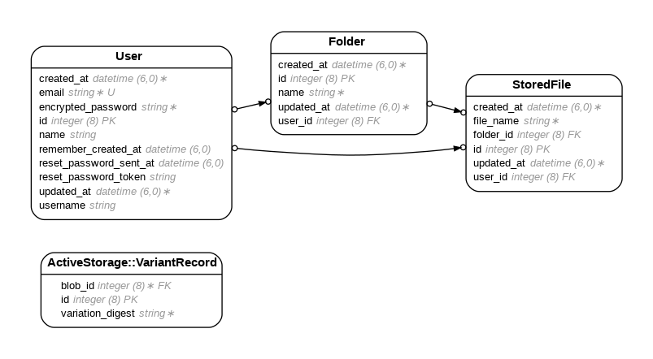

# File Vault

File Vault is a Rails 8 multi-tenant document storage app. A user signs up by naming their workspace and becomes its owner; admins can invite teammates by email at one of three roles, members share the same folders and files, and a single user can belong to several workspaces and switch between them. Sensitive folders can be restricted to specific people, files are stored on Cloudinary, and the dashboard surfaces recent activity and suggested folders. I built it to practice multi-tenant data modeling, role-based authorization with Pundit (including per-folder ACLs at the query layer), file uploads through Active Storage, an invitation flow with ActionMailer, service-object-driven domain logic, and deployment-ready Rails architecture.

**Live demo:** https://document-storage-mvp.onrender.com

---

## Screenshots

_[add 2-3 screenshots or a short GIF of the running app — ideally the folder dashboard, a folder with files, and the workspace settings / team page]_

---

## Features

- Email/password authentication with Devise
- Signup creates a User, a Workspace, and an Owner Membership in one atomic step — the user names the workspace as part of the form
- A user can belong to multiple workspaces; the sidebar workspace switcher swaps between them
- **Four roles per workspace:** **Owner** (one per workspace, can never be removed by others, can transfer ownership), **Admin** (can invite, promote, demote, remove non-owner members, and manage folder access), **Member** (can create and manage folders and files), and **Viewer** (read-only — can see and download but not create, edit, or delete)
- **Per-folder permissions.** A folder is workspace-public by default; granting it to specific people makes it "restricted" — only those people (plus all admins/owners) can see it. Enforced both in `FolderPolicy::Scope` (so restricted folders never appear in listings, search, or activity feeds for users who lack access) and in `FolderPolicy#show?`
- Email-based invitation flow with signed tokens, 7-day expiry, and an inline copy-link fallback for when SMTP isn't configured
- **Invite both new and existing accounts.** A new email lands on a signup-and-accept page; an email that already has an account is asked to sign in and is added to the workspace with a single Membership
- Members can leave a workspace they're in, except their last one (which would orphan them) and except if they're the Owner (transfer first)
- Create, rename, and delete folders
- Upload files into folders, stored on Cloudinary via Active Storage
- Content-type allowlist (PDFs, images, common documents/spreadsheets) and 25 MB cap per file
- Download files with attachment disposition
- Search within a folder by file name
- Bulk-delete multiple files in one action
- **Dashboard** with workspace stats, a weighted "suggested folders" list, and a unified recent-activity feed (uploads, folder creations, member joins, accepted invitations)
- **Team page** listing every member and pending invitation, ordered by role
- **Starter structure bootstrap** — seed a new workspace with a curated set of manufacturing-oriented folders in one click (idempotent)

---

## Tech stack

- Ruby 3.4 / Rails 8
- PostgreSQL (development, test, and production)
- Devise for authentication
- **Pundit** for authorization (policies + scopes)
- Active Storage with the Cloudinary service adapter
- ActionMailer for invitation emails (`letter_opener` in dev, SMTP in production)
- Hotwire (Turbo + Stimulus) for interactivity — no jQuery, no UJS, no SPA
- Bootstrap 5 (CSS + bundle) loaded via CDN
- RSpec + Capybara for testing
- Deployed on Render

---

## Architecture overview

- **Two-layer authorization: scoped queries underneath, Pundit on top.** Every controller action still loads records through `current_workspace.folders` / `current_workspace.stored_files` rather than `Folder.find` directly, so a user in workspace A literally cannot query a record in workspace B even by guessing the ID. On top of that, Pundit policies enforce role and per-folder rules. `pundit_user` is a `PunditContext` struct carrying `(user, membership)` so policies can read the caller's role in the current workspace without re-querying. Policies **default-deny** — every action returns `false` in `ApplicationPolicy` until a subclass overrides it, so a forgotten policy method fails closed.
- **Per-folder ACLs at the query layer.** A folder with no `folder_permissions` rows is public to the workspace; adding rows makes it restricted. `FolderPolicy::Scope#resolve` returns all folders for admins/owners, and for everyone else a `left_join` that keeps folders with *no* permission rows OR a row matching the current user. Because feeds and search filter through `policy_scope`, restricted folders never leak into the dashboard, recent activity, or suggestions.
- **Membership join table for multi-workspace users.** A `Membership` row carries `(user_id, workspace_id, role)` with a unique index on the pair. `User.workspaces` and `Workspace.users` go `through: :memberships`. The current workspace is held in the session (`session[:current_workspace_id]`) and validated on every request — switching is a `POST /workspaces/:id/switch` that confirms the user belongs there before flipping the session value.
- **Domain logic lives in service objects.** Anything that touches more than one record or needs a transaction is a service returning a `Result` struct: `Workspaces::Create`, `Workspaces::Bootstrap`, `Invitations::Create`, and `Memberships::{Promote, Demote, Transfer, Remove, Leave}`. Controllers stay thin and the same operation (e.g. "create workspace + owner membership") can't drift between signup and the logged-in "add workspace" path.
- **One Owner per workspace, enforced in the model.** `Membership` has a custom validation that rejects a second Owner on the same workspace. Ownership transfer (`Memberships::Transfer`) is a single transaction that demotes the current Owner to Admin and promotes a target Admin to Owner — the intermediate "no Owner" state is allowed momentarily but never observable outside the transaction.
- **Invitations as first-class records.** An `Invitation` carries the workspace, the inviter, the recipient email, the invited role (`viewer`/`member`/`admin` — never `owner`), a 32-byte URL-safe token, and an expiry timestamp. The accept endpoint is a public route keyed on the token. If the email already has an account, acceptance just adds a Membership; otherwise it creates the user and Membership in one transaction.
- **Derived activity feed, no audit table.** `RecentActivityQuery` builds the activity stream by merging recent rows from the models that already record "something happened" (file uploads, folder creations, member joins, accepted invitations) and sorting by timestamp — no separate `Activity` table to keep in sync. `SuggestedFoldersQuery` ranks folders by a simple weighted score (file count, recent uploads, starter-folder match).
- **No local file storage.** Active Storage is configured to use Cloudinary so the app stays stateless — uploads go straight to Cloudinary, downloads stream back through Active Storage, and the Render web instance has nothing on disk to back up.
- **Hotwire over a SPA.** Turbo handles navigation and destructive-action confirmations; small Stimulus controllers power the modal, the "select all" checkbox on the file list, the workspace-name copy-to-clipboard widget, and the restricted-folder toggle. No JavaScript framework and no API layer.
- **Foreign keys are NOT NULL.** Every `Folder` and `StoredFile` has both `workspace_id` and `user_id` (creator/uploader) enforced at the database level. `Membership.workspace_id` and `Membership.user_id` are NOT NULL with a unique compound index, and `FolderPermission` has a unique `(folder_id, user_id)` index.

---

## Local setup

Prerequisites: Ruby 3.4, PostgreSQL, and a free-tier Cloudinary account.

```bash
git clone https://github.com/Mrowe178566/document-storage-mvp
cd document-storage-mvp
bundle install
cp .env.example .env
# Fill in the Cloudinary and database values in .env
rails db:create db:migrate
rails server
```

The app runs at `http://localhost:3000`. Invitation emails open in your browser via `letter_opener` instead of being sent.

### Required environment variables

```
CLOUDINARY_CLOUD_NAME=...
CLOUDINARY_API_KEY=...
CLOUDINARY_API_SECRET=...
DATABASE_URL=postgresql://localhost/document_storage_mvp_development
MAIL_FROM=no-reply@filevault.local
```

In production, also set `APP_HOST` (e.g. `file-vault.onrender.com`) so invitation email links resolve correctly.

`.env` is gitignored.

---

## Running tests

```bash
bundle exec rspec
```

Tests cover model validations, associations, and scopes; the invitation lifecycle (send, accept-as-new-user, accept-as-existing-user, expiry); the Membership constraints (only one Owner per workspace, no duplicate user/workspace pairs); the signup-creates-Owner flow; end-to-end file upload and download; cross-workspace access being blocked; folder destroy with stored-file cascade; the Pundit policies (including per-folder visibility and the default-deny base); every role-management action (promote / demote / transfer ownership / remove / self-leave); and workspace switching.

---

## Authorization model at a glance

| Action | Viewer | Member | Admin | Owner |
| --- | :---: | :---: | :---: | :---: |
| See & download files in accessible folders | ✅ | ✅ | ✅ | ✅ |
| Create / rename / delete folders & files | — | ✅ | ✅ | ✅ |
| See restricted folders | only if granted | only if granted | ✅ | ✅ |
| Manage folder access (restrict / grant) | — | — | ✅ | ✅ |
| Invite, promote, demote, remove members | — | — | ✅ | ✅ |
| Transfer ownership | — | — | — | ✅ |

`admin?` in the codebase means **owner OR admin** (i.e. "can manage the workspace"); use `owner?` when you specifically mean the single owner.

---

## Challenges, tradeoffs, and what I'd build next

**Scoped queries *and* Pundit, not one or the other.** The app started with authorization pushed entirely into `current_workspace`-scoped lookups — one obvious pattern, hard to misuse. That holds the tenant boundary, but it can't express "this folder is visible only to a subset of the workspace." So I layered Pundit on top: scoped queries still guarantee you can't touch another tenant's data, and policies handle role checks and per-folder ACLs. The cost is two places to reason about; the win is that neither layer has to do the other's job.

**Per-folder permissions as presence-of-rows, not a flag.** A folder is restricted *iff* it has any `folder_permissions` rows — there's no separate `restricted` boolean to keep in sync with the grant list. The visibility query is a single `left_join ... WHERE folder_permissions.id IS NULL OR folder_permissions.user_id = ?`. The tradeoff is that "make this public again" means deleting rows rather than flipping a flag, but it removes a whole class of "flag says restricted, but nobody's granted" inconsistency.

**One Owner per workspace, enforced in the model.** The `Membership` model rejects a second Owner row in the same workspace via a custom validation rather than a database partial unique index. Ownership transfer goes through a single-transaction demote+promote so the intermediate state is invisible.

**Service objects with Result structs instead of fat controllers or callbacks.** Multi-record operations live in `app/services` and return `Result.new(success?:, …, error:)`. This keeps transactional logic testable in isolation and out of model callbacks (which would fire in contexts I don't want), at the cost of a little ceremony per operation.

**Cloudinary instead of S3.** Cloudinary's free tier is generous and the gem integrates cleanly with Active Storage, giving a fully cloud-backed deployment without an AWS account. The tradeoff is dependence on Cloudinary's pricing and less control over storage region and transformation pipelines.

**Folder-scoped search instead of global search.** The search filter only applies within the folder being viewed (`where("file_name ILIKE ?", sanitize_sql_like(query))`). This keeps the query trivial, but global search is the most-requested missing feature.

**What I'd build next, in order:**
1. **Real per-user pinning.** The "Pinned" page is currently a styled placeholder with an empty state — the `FolderPin` model and toggle still need to ship.
2. **Email confirmation on signup** (Devise `:confirmable`) once production SMTP is fully wired — currently anyone can sign up with any email address.
3. **Global search across folders** within a workspace (a cross-folder index or a Postgres full-text column on `stored_files`), respecting `policy_scope` so restricted folders stay hidden.
4. **PDF and image previews** inline in the folder view.
5. **File versioning** (replace a file without losing the previous version).
6. **Persistent audit log** — promote the derived `RecentActivityQuery` feed to a real `Activity` table if/when retention or tamper-evidence matters.

---

## Data model



---

## License

MIT — Maia Rowe
